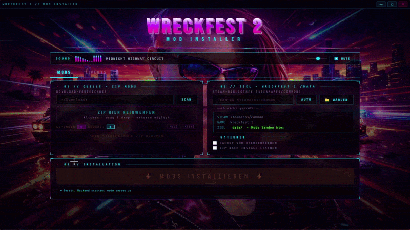

# WRECKFEST 2 — MOD INSTALLER

### by QueenOfPain666 // ROTA

Portable Mod Installer für Wreckfest 2.

ZIP reinziehen → installieren → fertig.

Kein Setup. Kein Bullshit.



---

## 🔥 FEATURES

* Drag & Drop ZIP Mods
* Auto Steam Path Detection
* Manueller Pfad (Fallback)
* Mod Vorschau vor Installation
* Optionales Backup
* Portable (kein Install nötig)

---

## 📦 DOWNLOAD

Fertige Version gibt’s unter **Releases**.

---

## 🧪 STATUS

Work in progress.
Feedback ist willkommen.

---

## 🧠 WAS DIE APP MACHT

* Installiert Mods direkt nach:
  `steamapps/common/Wreckfest 2/data/`
* Startet Backend intern (kein extra Terminal)
* Native UI (Electron, frameless)
* Musik & visuelle Effekte integriert

---

## 🛠️ BUILD (für Entwickler)

### Voraussetzungen

* Node.js 18+ — https://nodejs.org

### Schritte

```bash
npm install
npm run build:win
npm run build:linux
```

---

## 📁 DATEISTRUKTUR

```
main.js
preload.js
index.html
bg.jpg
Midnight_Highway_Circuit.mp3
icon.png
package.json
```

---

*Kein isotonengetränk wurde beim Bauen verschüttet.*
